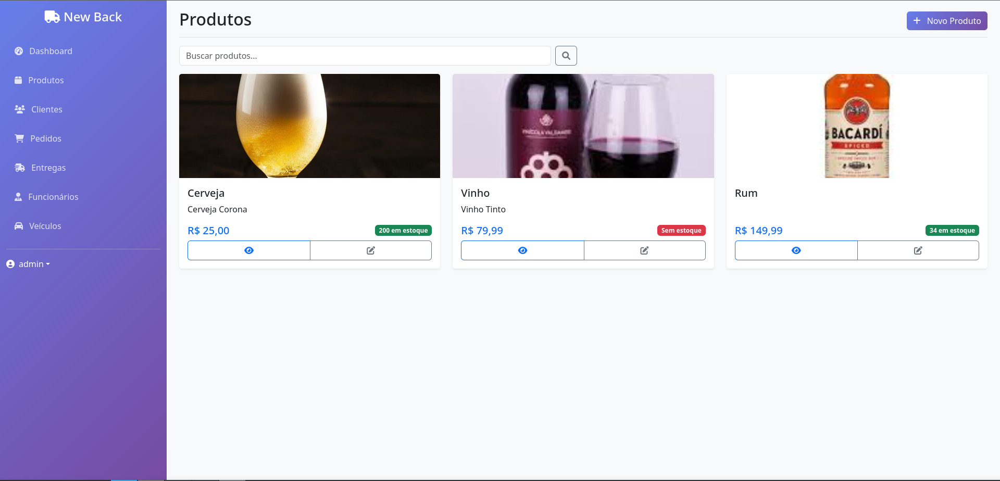

# 📦 NewBack
Plataforma de gerenciamento de vendas



---

## :truck: O que é NewBack

É uma plataforma para negócios de **gerenciamento de vendas**, entre outras coisas ela:

* Cadastra e gerencia **clientes**
* Gerencia **produtos** com seus respectivos preços e estoques
* Gerencia **funcionários** e seus departamentos

---

## ⚙️ Pré-requisitos

* Docker 27.3

---

## 📂 Estrutura do Projeto

```
NewBack/
├── docs/            # Documentação (ex: diagrama do Banco de dados)
├── src/             # Código fonte do projeto
   ├── manage.py        # Arquivo de execução do Django
   ├── db.sqlite3       # Banco de dados
   └── <resto dos arquivos fonte>
├── .gitignore       # gitignore
├── LICENSE          # Licença do projeto
└── README.md        # Readme do projeto
```

---

## 🔧 Executando o projeto com Docker

### Windows

1. Instale o Docker Desktop, pode achar o download [aqui](https://www.docker.com/products/docker-desktop/)
2. Após instalar, abra o Docker Desktop e aguarde até estar totalmente aberto
3. Abra Powershell e execute o seguinte comando nele, substituindo ```<TAG>``` pelo tag do conteiner
```powershell
docker run -p 8000:8000 juniorrosa/newback:<TAG>
```

### Linux
1. Primeiro é necessário instalar o Docker, para isso pode seguir o guia em https://docs.docker.com/engine/install/. Lembre de selecionar o seu distro
2. Após instalar abra o terminal e execute o comando, substituindo `<TAG>` pelo tag do conteiner
```bash
sudo docker run -p 8000:8000 juniorrosa/newback:<TAG>
```

> Se não saber qual é o tag acesse https://hub.docker.com/r/juniorrosa/newback/tags e use o último tag (exemplo: 1.0)

### Abrindo o projeto
Depois de executar o conteiner do projeto, pode abrir o frontend dele acessando o site `localhost:8000` em qualquer navegador